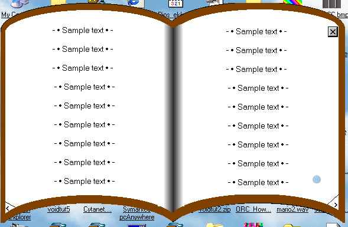



## Custom Shaped form \- A function that can convert shapes to regions\!\!

### Description

WOW! COOL !WOW

You Can convert a shape to a region, combine it with an other shape and eventually shape a form with it!!

Very easy to use!
 
### More Info
 

             |
---                |---
**Submitted On**   |2002-05-06 18:32:58
**By**             |[Lefteris Eleftheriades](https://github.com/Planet-Source-Code/PSCIndex/blob/master/ByAuthor/lefteris-eleftheriades.md)
**Level**          |Intermediate
**User Rating**    |5.0 (20 globes from 4 users)
**Compatibility**  |VB 5\.0, VB 6\.0
**Category**       |[Graphics](https://github.com/Planet-Source-Code/PSCIndex/blob/master/ByCategory/graphics__1-46.md)
**World**          |[Visual Basic](https://github.com/Planet-Source-Code/PSCIndex/blob/master/ByWorld/visual-basic.md)
**Archive File**   |[Custom\_Spa80477572002\.zip](https://github.com/Planet-Source-Code/lefteris-eleftheriades-custom-shaped-form-a-function-that-can-convert-shapes-to-regions__1-34535/archive/master.zip)

